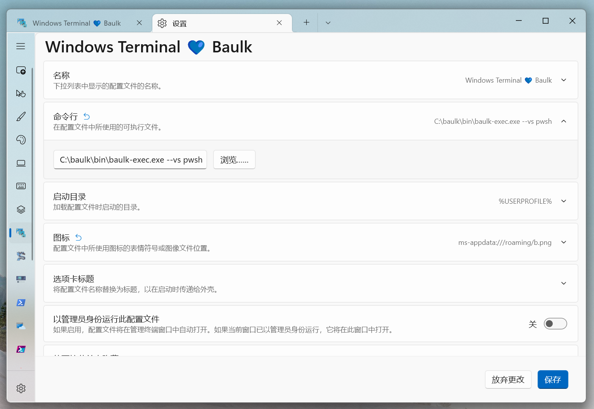

# Baulk - Minimal Package Manager for Windows

[](LICENSE)
[](https://github.com/baulk/baulk/actions)
[](https://github.com/baulk/baulk/releases/latest)
[](https://github.com/baulk/baulk/releases)
[](https://github.com/baulk/baulk/releases/latest)
[](https://996.icu)


[简体中文](./ReadMe.zh-CN.md)

Baulk is a minimalist, portable package manager for Windows. 

## Why Baulk

Baulk was originally born to solve the inefficiency of the package manager command `devi` of [Clangbuilder](https://github.com/fstudio/clangbuilder), and `devi` is based on Powershell, and the poor performance is self-evident. 

In May 2020, when Microsoft announced the Windows Package Manager Preview, Baulk had been in development for several months. It did not mean that winget appeared, and similar tools would not develop. In addition, Baulk is better than package managers such as winget/scoop in terms of portability, isolation, virtual environment, and zero dependencies on tools. These are the reasons for its existence. 

Features
+  Core feature is of course the package management function, which is portable and free of installation. All packages, whether msi/exe or other archives, will be decompressed by Baulk to the root directory of the package itself. 
+  Environment isolation and virtual environment 
    +  All packages have their own directory, and the invocation of the program in the package is initiated through its launcher or symbolic link, and the environment variables do not interfere or affect. 
    +  There are different major versions of the same software, and different distributions can be switched through venv, such as openjdk/msjdk. 
+  Excellent package extraction experience: Baulk itself provides decompression capabilities in zip/tar and other formats, supports automatic detection of filename encoding, and avoids garbled filenames caused by CodePagde. 
    +  Baulk also provides baulk extract/unzip/untar commands for users to use baulk's decompression function in other scenarios.
    +  Baulk also provides Unscrew Extractor (unscrew) a minimalist graphical decompression tool that can be integrated into the right-click menu to provide the ability to decompress `tar.*` files with one click. 
+  Limited compatibility with scoop manifest (compatibility mode, inability to use baulk advanced features like environment isolation and virtual environments). 
+  Written in pure C++20 with superior performance.
+  IntelliSense network settings when downloading packages.
+  Supports updating buckets using github-archives or git.
+  Baulk also provides the `baulk brand` command to detect operating system information.

## Get Started

We can go to Github Release to download the latest version：[https://github.com/baulk/baulk/releases/latest](https://github.com/baulk/baulk/releases/latest), If in doubt, refer to the table below. 

|Installation Mode|x64|arm64|Remark|
|---|---|---|---|
|Completely Portable|`Baulk-${VERSION}-win-x64.zip`|`Baulk-${VERSION}-win-arm64.zip`|Unzip it to any directory and double-click baulk-terminal.exe (you can also create a shortcut for it)|
|Installation without administrator rights|`BaulkSetup-x64.exe`|` BaulkSetup-arm64.exe`|Double click to run the installer|
|Install with administrator privileges|`BaulkSetup-x64.exe`|`BaulkSetup-arm64.exe`|Double click to run the installer|
|Experimental Experience Appx|`Baulk-x64.appx`|`Baulk-arm64.appx`|`baulk version > 4.0`|


Once installed you can experience Baulk:

```powershell
# Install any packages you need
# baulk i neovim curl wget ripgrep belautils
baulk install neovim curl wget ripgrep belautils
# Now you can run commands like curl in Windows Terminal 
curl -V
# update metadata (bucket)
# baulk u --> baulk update && baulk upgrade
baulk update
# upgrade package
baulk upgrade
# uninstall package
# baulk r wget
baulk uninstall wget
```

Look, it's so simple! 


Search package:


Integration into Windows Terminal (shell replacement)：



## Changelog

[Changelog](./docs/changelog.md)

## Baulk tools usage

Usually you can run `baulk -h` to see help for commands (other commands are also `-h`), you can also see：[Detailed Help](./docs/help.md)

## Advanced Experience with Baulk


## Article

[《Baulk - 开发一个简单的包管理工具历程》](https://forcemz.net/toolset/2020/07/18/Baulk/)

## Thanks

Baulk depends many license-friendly open source projects, I would like to express my sincere gratitude. 

+   [Bela - Modern C++ development experience](https://github.com/fcharlie/bela.git)
+   [Ppmd - Extract `ZIP-Ppmd`](https://www.7-zip.org/sdk.html)
+   [Brotli - Extract `tar.br` and `ZIP-Brotli`](https://github.com/google/brotli)
+   [bzip2 - Extract `tar.bz` and `ZIP-bzip2`](https://sourceware.org/bzip2/)
+   [Compact Encoding Detection - zip non-UTF-8 file name encoding detection](https://github.com/google/compact_enc_det)
+   [zlib (Chromium variants)  - Extract `tar.gz` and `ZIP-deflate`](https://github.com/chromium/chromium/tree/master/third_party/zlib)
+   [zlib (deflate64) - Extract `ZIP-deflate64`](https://github.com/madler/zlib/tree/master/contrib/infback9)
+   [liblzma - Extract `tar.xz` and `ZIP-xz`](https://tukaani.org/xz/)
+   [zstd - Extract `tar.zst` and `ZIP-zstd`](https://github.com/facebook/zstd)
+   [mimalloc - mimalloc is a compact general purpose allocator with excellent performance](https://github.com/microsoft/mimalloc)

<div>Baulk Icons made by <a href="https://www.flaticon.com/authors/smashicons" title="Smashicons">Smashicons</a> from <a href="https://www.flaticon.com/" title="Flaticon">www.flaticon.com</a></div>


