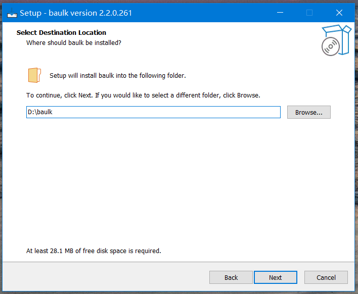
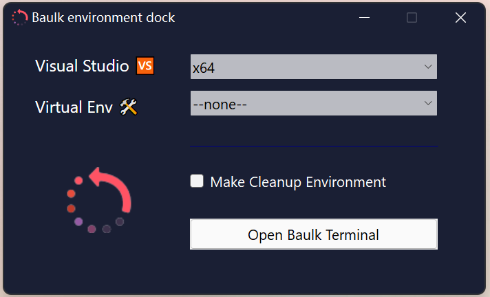

# Baulk - Minimal Package Manager for Windows

[](LICENSE)
[](https://github.com/baulk/baulk/actions)
[](https://github.com/baulk/baulk/releases/latest)
[](https://github.com/baulk/baulk/releases)
[](https://github.com/baulk/baulk/releases/latest)
[](https://996.icu)
[](https://open.vscode.dev/baulk/baulk)


[简体中文](./ReadMe.zh-CN.md)

A minimalist Windows package manager, installation-free, without modifying system environment variables, easy to use, can be integrated with Windows Terminal, can be added to the right-click menu...

## Baulk 4.0 Event

We plan to release baulk 4.0 version on April 1, 2022. This version adds a vfs mechanism to avoid mixing program data and installed packages when installing packages. It also adds the following features: 

- Better **VFS** design
- More C++20/23 experience
- Better file extraction experience, add `baulk extract` command.
- Limited compatibility with scoop manifest (Compatibility mode operation, with certain limitations) 
- baulk breakpoint download support
- Integrate a better memory allocator, such as mimalloc
- baulk brand command (such as neofetch)


The following functions were not completed because I didn't have enough time:

- Windows 11 context menu support

## Get Started

Download the latest version of Baulk: [https://github.com/baulk/baulk/releases/latest](https://github.com/baulk/baulk/releases/latest), You can choose to download the installation program corresponding to the Windows platform. The installation program provided by Baulk can be run without administrator rights. You can install it to any directory with non-administrator rights. You can check to create a desktop shortcut: 



Or you can download the compressed package and unzip it to any directory, click on `baulk-terminal.exe` to run Windows Terminal. 


```powershell
baulk update
# install some package which your need
baulk install baulktar baulk7z neovim curl wget ripgrep
# now you can run curl under Windows Terminal
curl -V
# update bucket metadata
baulk update
# upgrade all upgradeable packages
baulk upgrade
# uninstall specific packages
baulk uninstall wget
```

**This is the most basic operation. If you need to know more about baulk, you can continue to read the introduction below.**

## Baulk Usage and Details

The baulk command is the core of the Baulk package manager, which implements functions such as installation, upgrade, and uninstallation of various reports. The command line parameters of baulk are roughly divided into three parts. The first part is `option`, which is used to specify or set some variables; the second part is `command`, which is the baulk subcommand, including installation and uninstallation, upgrade, update, freeze, unfreeze, etc. Command; the third part is the args following the command. 

```txt
baulk - Minimal Package Manager for Windows
Usage: baulk [option] <command> [<args>]
  -h|--help        Show usage text and quit
  -v|--version     Show version number and quit
  -V|--verbose     Make the operation more talkative
  -Q|--quiet       Make the operation more quiet
  -F|--force       Turn on force mode. such as force update frozen package
  -P|--profile     Set profile path. default: $0\config\baulk.json
  -A|--user-agent  Send User-Agent <name> to server
  -k|--insecure    Allow insecure server connections when using SSL
  -T|--trace       Turn on trace mode. track baulk execution details.
  --https-proxy    Use this proxy. Equivalent to setting the environment variable 'HTTPS_PROXY'
  --force-delete   When uninstalling the package, forcefully delete the related directories


Command:
  version          Show version number and quit
  list             List installed packages based on package names
  search           Search in package descriptions
  info             Show package information
  install          Install specific packages. upgrade if already installed. (alias: i)
  uninstall        Uninstall specific packages. (alias: r)
  update           Update bucket metadata
  upgrade          Upgrade all upgradeable packages
  freeze           Freeze specific package
  unfreeze         UnFreeze specific package
  b3sum            Calculate the BLAKE3 checksum of a file
  sha256sum        Calculate the SHA256 checksum of a file
  cleancache       Cleanup download cache
  bucket           Add, delete or list buckets
  untar            Extract files in a tar archive. support: tar.xz tar.bz2 tar.gz tar.zstd
  unzip            Extract compressed files in a ZIP archive

Alias:
  i  install
  r  uninstall
  u  update and upgrade

See 'baulk help <command>' to read usage a specific subcommand.

```

|Command|Description|Remarks|
|---|---|---|
|list|View installed packages|N/A|
|search|Search for packages available in Bucket|baulk search command supports file name matching mode, for example `baulk search *` will search all packages in Bucket|
|info|Show package information|N/A|
|install|Install specific packages|install also has other features, when the package has been installed will rebuild the launcher, when there is a new version of the package will upgrade it, `--force` will upgrade the frozen package|
|uninstall|Uninstall a specific package|N/A|
|update|update bucket metadata|similar to Ubuntu apt update command|
|upgrade|Update packages with new versions|`--force` can upgrade frozen packages|
|freeze|Freeze specific packages|Frozen packages cannot be upgraded in regular mode|
|unfreeze|Unfreeze the package|N/A|
|b3sum|Calculate the BLAKE3 hash of the file|N/A|
|sha256sum|Calculate the SHA256 hash of the file|N/A|
|cleancache|cleanup download cache|30 days expired, all cached download file will remove when add `--force` flag||
|bucket|add, delete or list buckets|N/A|
|untar|built-in tar file extraction support |support tar/tar.gz/tar.bz2/tar.xz/tar.zst/tar.br(brotli)|
|unzip|built-in zip file extraction support |zip method support deflate/deflate64/bzip2/lzma/zstd/ppmd<br>Support file name encoding detection to avoid file name garbled when decompressing. |
|extract|detect file format and extract|N/A|

Example:

```powershell
baulk list
baulk search *w
baulk info wget
baulk freeze python
baulk unfreeze python
baulk update
baulk upgrade
```

See `baulk help <command>` to read usage a specific subcommand.

### Baulk configuration file

The default path of the baulk configuration file is `$ExecutableDir/../config/baulk.json`, which can be specified by setting the parameter `--profile`. Unless you need to customize the bucket or some other operation, otherwise do not need to modify the configuration file.

### Bucket management

In the bucket configuration file, we need to set `bucket`, which is used to store the source data of the baulk installation software. Buckets currently only support storage on git code hosting platforms, such as Github. To install software using baulk, there must be at least one `bucket`. The default bucket of baulk is [https://github.com/baulk/bucket](https://github.com/baulk/bucket). The bucket configuration is as follows:

**baulk.json**:

```json
{
    "bucket": [
        {
            "description": "Baulk default bucket",
            "name": "Baulk",
            "url": "https://github.com/baulk/bucket",
            "weights": 100
        }
    ]
}
```

In `bucket`, we designed the `weights` mechanism. In different `buckets`, if there is a package with the same name and the package version is the same, we will compare the `weights` of `bucket` The larger ones will be installed.

`baulk bucket add` usage：

```txt
Usage: baulk bucket <option> [bucket]...
Add, delete or list buckets.
  -N|--name           set bucket name
  -U|--url            set bucket url
  -W|--weights        set bucket weights, default: 100
  -M|--mode           set bucket mode (Git/Github)
  -A|--variant        set bucket variant (native/scoop)
  -D|--description    set bucket description
  -R|--replace        replace bucket with new attributes ('bucket add' support only)

Option:
  list, add, delete

Command Usage:
  baulk bucket list
  baulk bucket list BucketName

  baulk bucket add URL
  baulk bucket add BucketName URL
  baulk bucket add BucketName URL Weights
  baulk bucket add BucketName URL Weights Description

  baulk bucket delete BucketName

Example:
  baulk bucket add baulk git@github.com:baulk/bucket.git
  baulk bucket add baulk-mirror https://gitee.com/baulk/bucket.git -MGit -W102
  baulk bucket add scoop git@github.com:ScoopInstaller/Main.git -MGit -Ascoop

```

Delete some bucket:

```shell
baulk bucket delete BucketName
```

List buckets:

```shell
baulk bucket list
```


To synchronize buckets, you can run the `baulk update` command. This is similar to `apt update`. The baulk synchronization bucket adopts the RSS synchronization mechanism, which is to obtain the latest commit information by requesting the bucket repository, compare the latest commitId with the last commitId recorded locally, and download the git archive to decompress it locally if they are inconsistent. The advantage of this mechanism is that it can support synchronization without installing git.

### Package management

baulk uses the bucket to record the download address of the package, the file hash, and the initiator that needs to be created. The default bucket repository is [https://github.com/baulk/bucket](https://github.com/baulk/bucket), of course, you can also create a bucket according to the layout of the `baulk/bucket` repository. Baulk bucket actually draws on Scoop to a certain extent, but baulk does not force the use of file hash verification, but only supports SHA256 during verification It is different from BLAKE3 and Baulk's installation mechanism.

The commands for the baulk management package include `install`, `uninstall`, `upgrade`, `freeze` and `unfreeze`, and `list` and `search`. Installing software using baulk is very simple, the command is as follows:

```shell
# Install cmake git and 7z
baulk install cmake git 7z
```

`baulk install` will install specific packages. During the installation process, baulk will read the metadata of the specific packages from the bucket. The format of these metadata is generally as follows:

```json
{
    "description": "CMake is an open-source, cross-platform family of tools designed to build, test and package software",
    "version": "3.17.2",
    "url": [
        "https://github.com/Kitware/CMake/releases/download/v3.17.2/cmake-3.17.2-win32-x86.zip",
        "https://cmake.org/files/v3.17/cmake-3.17.2-win32-x86.zip"
    ],
    "url.hash": "SHA256:66a68a1032ad1853bcff01778ae190cd461d174d6a689e1c646e3e9886f01e0a",
    "url64": [
        "https://github.com/Kitware/CMake/releases/download/v3.17.2/cmake-3.17.2-win64-x64.zip",
        "https://cmake.org/files/v3.17/cmake-3.17.2-win64-x64.zip"
    ],
    "url64.hash": "SHA256:cf82b1eb20b6fbe583487656fcd496490ffccdfbcbba0f26e19f1c9c63b0b041",
    "extension": "zip",
    "links": [
        "bin\\cmake.exe",
        "bin\\cmake-gui.exe",
        "bin\\cmcldeps.exe",
        "bin\\cpack.exe",
        "bin\\ctest.exe"
    ]
}
```

baulk downloads the compressed package according to the URL set in the list. If there is a compressed package with the same name and the hash value matches locally, the local cache is used. baulk uses WinHTTP to download the compressed package. Currently it can better support HTTP Proxy, of course, it can also be passed Set the environment variables and command line parameters to set the proxy. baulk allows no hashes to be set in the list. The hash of baulk is set to `HashPrefix:HashContent` format. If there is no hash prefix, the default is `SHA256`. The following table is the hash algorithm supported by baulk.

|Hash algorithm|Prefix|Remarks|
|---|---|---|
|SHA224|`SHA224`||
|SHA256|`SHA256`||
|SHA384|`SHA224`||
|SHA512|`SHA224`||
|SHA3-224|`SHA3-224`||
|SHA3-256|`SHA3-256`, `SHA3`|`SHA3` prefix specific ☞ `SHA3-256`|
|SHA3-384|`SHA3-384`||
|SHA3-512|`SHA3-512`||
|BLAKE3|`BLAKE3`||

In baulk, `extension` supports `zip`, `msi`, `7z`, `exe`, `tar`, and baulk executes the corresponding decompression program according to the type of `extension`. The extended decompression procedure is as follows:

|Extended|Unzip Program|Limited|
|---|---|---|
|`exe`|-|-|
|`zip`|Built-in|Support deflate/bzip2/zstd/deflate64/xz/ppmd, Not support encryption|
|`msi`|Built-in, based on MSI API|-|
|`7z`|Priority:</br>baulk7z - Baulk distribution</br>7z - installed by baulk</br>7z - find in `PATH`|decompress format support by 7-zip|
|`tar`|Built-in|Support gzip/xz/zstd/bzip/brotli|
|`auto`|-|Automatically detect file format, support scoop package|

In the manifest file, there may also be `links/launchers`, and baulk will create symbolic links for specific files according to the settings of `links`. With Visual Studio installed, baulk will create a launcher based on the `launchers` setting, if If Visual Studio is not installed, it will use `baulk-lnk` to create an analog launcher. If baulk runs on Windows x64 or ARM64 architecture, there will be some small differences, that is, the platform-related URL/Launchers/Links is preferred, as follows:

|Architecture|URL|Launchers|Links|Remarks|
|---|---|---|---|---|
|x86|url|launchers|links|-|
|x64|url64, url|launchers64, launchers|links64, links|If the launchers/links of different architectures have the same goal, you don’t need to set them separately|
|ARM64|urlarm64, url|launchersarm64, launchers|linksarm64, links|If launchers/links of different architectures have the same goal, you don’t need to set them separately|


Tips: In Windows, after starting the process, we can use `GetModuleFileNameW` to get the binary file path of the process, but when the process starts from the symbolic link, the path of the symbolic link will be used. If we only use `links` in baulk to create symbolic links to the `links` directory, there may be a problem that a specific `dll` cannot be loaded, so here we use the `launcher` mechanism to solve this problem.

When running `baulk install`, if the software has already been installed, there may be two situations. The first is that the software has not been updated, then `baulk` will rebuild `links` and `launchers`, which is applicable to different packages. In the same `links`/`launchers` installation, overwriting needs to be restored. If there is an update to the software, baulk will install the latest version of the specified package.

`baulk uninstall` will remove the package and the created launcher, symbolic link. `baulk upgrade` By searching for already installed packages, if a new version of the corresponding package exists, install the new version.

There is also a `freeze/unfreeze` command in baulk. `baulk freeze` will freeze specific packages. Using `baulk install/baulk upgrade` will skip the upgrade of these packages. However, if `baulk install/baulk upgrade` is used The `--force/-f` parameter will force the upgrade of the corresponding package. We can also use `baulk unfreeze` to unfreeze specific packages.

In baulk, we can use `baulk search pattern` to search for packages added in the bucket, where `pattern` is based on file name matching, and the rules are similar to [POSIX fnmatch](https://linux.die.net/man/3/fnmatch). Running `baulk search *` will list all packages.

In baulk, we can use `baulk list` to list all installed packages, and `baulk list pkgname` to list specific packages.


### Miscellaneous

Baulk provides sha256sum b3sum two commands to help users calculate file hashes.

## Baulk Virtual environment mechanism

In order to install different versions of the same software at the same time, baulk implements a virtual environment mechanism. By specifying `-Exxx` in baulk-terminal or baulk-exec to load a specific package environment, for example, `-Eopenjdk15` loads openjdk15, `-Eopenjdk14` can load Openjdk14, these packages need to be configured in the bucket warehouse. In addition, baulk-dock can be switched graphically. Unlike baulk-exec, baulk-exec can load multiple VENVs at the same time, while baulk-dock only supports one.

## Baulk executor

baulk provides the `baulk-exec` command, which is a special launcher. Through this command, we can initialize the isolated baulk environment variable context and start a new process. The new process inherits the baulk isolated environment variable context. The tool enables baulk to install multiple versions of the same software in parallel, and releases provided by different manufacturers do not need to take into account environmental variables to interfere with each other. The advantage of using baulk-exec is that there is no need to modify the system environment variables, the environment variable context is temporary, and the process is destroyed when it exits. At present, the Baulk Terminal we run is also implemented by baulk-exec, and baulk-exec can also be widely used in various CI pipelines. 

baulk-exec usage:

```txt
baulk-exec - Baulk extend executor
Usage: baulk-exec [option] <command> [<args>] ...
  -h|--help            Show usage text and quit
  -v|--version         Show version number and quit
  -V|--verbose         Make the operation more talkative
  -C|--cleanup         Create clean environment variables to avoid interference
  -W|--cwd             Set the command startup directory
  -A|--arch            Select a specific arch, use native architecture by default
  -E|--venv            Choose to load a specific package virtual environment
  --vs                 Load Visual Studio related environment variables
  --vs-preview         Load Visual Studio (Preview) related environment variables
  --time               Summarize command system resource usage

example:
  baulk-exec -V --vs TUNNEL_DEBUG=1 pwsh

```

## Baulk Windows Terminal integration

Baulk also provides the `baulk-terminal.exe` program, which is highly integrated with Windows Terminal and can start Windows Terminal after setting the Baulk environment variable, which solves the problem of avoiding conflicts caused by tool modification of system environment variables and anytime. In addition, Baulk added a custom installation option integrated into the Windows Terminal plug-in during the installation process. You can also use Fragments.bat to manually integrate Baulk into Windows Terminal.

baulk-terminal (`baulk < 4.0 aka baulkterminal`) usage:

```txt
baulk-terminal - Baulk Terminal Launcher
Usage: baulk-terminal [option] ...
  -h|--help
               Show usage text and quit
  -v|--version
               Show version number and quit
  -V|--verbose
               Make the operation more talkative
  -C|--cleanup
               Create clean environment variables to avoid interference
  -S|--shell
               The shell you want to start. allowed: pwsh, bash, cmd, wsl
  -W|--cwd
               Set the shell startup directory
  -A|--arch
               Select a specific arch, use native architecture by default
  -E|--venv
               Choose to load one/more specific package virtual environment
  --vs
               Load Visual Studio related environment variables
  --vs-preview
               Load Visual Studio (Preview) related environment variables
  --conhost
               Use conhost not Windows terminal

```

In addition to starting Windows Terminal through baulktermainl, you can also modify the command line of the default terminal of Windows Terminal and use baulk-exec to start the shell, so that the newly created shell has the environment variable context of baulk. For example, change the command line of Powershell Core to: 

```
C:\Dev\baulk\bin\baulk-exec.exe --vs pwsh
```

## Baulk Dock

Baulk Dock **Light Mode**:


Baulk Dock **Dark Mode**:



## Baulk upgrade

At present, we use the Github Release Latest mechanism to upgrade Baulk itself. When executing Github Actions, when new tags are pushed, Github Actions will automatically create a release version and upload the binary compressed package. In this process, the tag information will be compiled into the baulk program. When running `baulk-update` locally (please note that baulk update is to update the bucket and baulk-update are not the same command), it will check whether the local baulk is in the tag, If it is not built on Github Actions, the next step will not be checked unless the `--force` parameter is set. If it is a tag built on Github Actions, check whether it is consistent with Github Release Latest, inconsistently download the binary of the corresponding platform, and then Update Baulk.

## Article

[《Baulk - 开发一个简单的包管理工具历程》](https://forcemz.net/toolset/2020/07/18/Baulk/)

## Thanks

Baulk depends many license-friendly open source projects, I would like to express my sincere gratitude. 

+   [Bela - Modern C++ development experience](https://github.com/fcharlie/bela.git)
+   [Ppmd - Extract `ZIP-Ppmd`](https://www.7-zip.org/sdk.html)
+   [Brotli - Extract `tar.br` and `ZIP-Brotli`](https://github.com/google/brotli)
+   [bzip2 - Extract `tar.bz` and `ZIP-bzip2`](https://sourceware.org/bzip2/)
+   [Compact Encoding Detection - zip non-UTF-8 file name encoding detection](https://github.com/google/compact_enc_det)
+   [zlib (Chromium variants)  - Extract `tar.gz` and `ZIP-deflate`](https://github.com/chromium/chromium/tree/master/third_party/zlib)
+   [zlib (deflate64) - Extract `ZIP-deflate64`](https://github.com/madler/zlib/tree/master/contrib/infback9)
+   [liblzma - Extract `tar.xz` and `ZIP-xz`](https://tukaani.org/xz/)
+   [zstd - Extract `tar.zst` and `ZIP-zstd`](https://github.com/facebook/zstd)
+   [mimalloc - mimalloc is a compact general purpose allocator with excellent performance](https://github.com/microsoft/mimalloc)

<div>Baulk Icons made by <a href="https://www.flaticon.com/authors/smashicons" title="Smashicons">Smashicons</a> from <a href="https://www.flaticon.com/" title="Flaticon">www.flaticon.com</a></div>


