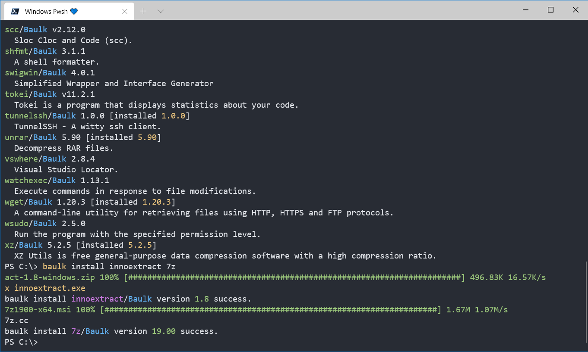
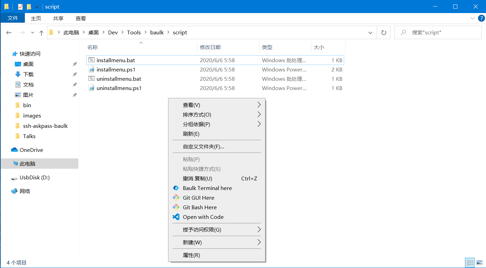
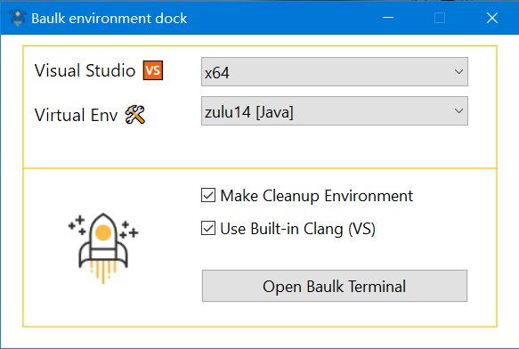

# Baulk - Windows 极简包管理器

[](LICENSE)
[](https://github.com/baulk/baulk/actions)
[](https://github.com/baulk/baulk/releases/latest)
[](https://github.com/baulk/baulk/releases)
[](https://github.com/baulk/baulk/releases/latest)
[](https://996.icu)


Baulk 是一个极简的 Windows 包管理器，免安装，不修改系统环境变量，易于使用，能够和 Windows Terminal 集成，能够添加到右键菜单... 无论是 zip/7z/msi 都能管理。

## 开始使用 

下载 Baulk 最新版本：[https://github.com/baulk/baulk/releases/latest](https://github.com/baulk/baulk/releases/latest), 然后将其解压到任意目录, 点击 `baulkterminal.exe` 后即可运行 Windows Terminal。



```powershell
baulk update
# 安装你需要的任意软件包
baulk install baulktar baulk7z neovim curl wget ripgrep
# 现在你可以在 Windows Terminal 中运行 curl 等命令了
curl -V
# 更新源数据
baulk update
# 升级可升级的包
baulk upgrade
# 卸载你不需要的包
baulk uninstall wget
```

你可以右键以管理员权限运行 `script/installmenu.bat` 将 baulkterminal 添加到右键菜单，这样你就能在任意目录打开初始化 Baulk 环境的 Windows Terminal 了。

请注意 `script/installmenu.bat` 默认开启了 `--vs` 即初始化 Visual Studio 环境，版本 > 1.5.2 如果没有安装便不会初始化。



**上面就是 Baulk 的基本使用了，非常简单，如果你需要对 Baulk 有个更深入的了解，可以继续阅读下面的内容。**

## 命令行参数

baulk 的命令行参数大致分三部分，第一部分是 `option`，用于指定或者设置一些变量；第二部分是 `command` 即 baulk 子命令，包括安装卸载，升级，更新，冻结，解除冻结等命令；第三部分则是跟随命令后参数。当然具体命令具体分析，不能僵硬的理解。

```txt
baulk - Minimal Package Manager for Windows
Usage: baulk [option] <command> [<args>]
  -h|--help        Show usage text and quit
  -v|--version     Show version number and quit
  -V|--verbose     Make the operation more talkative
  -Q|--quiet       Make the operation more quiet
  -F|--force       Turn on force mode. such as force update frozen package
  -P|--profile     Set profile path. default: $0\config\baulk.json
  -A|--user-agent  Send User-Agent <name> to server
  -k|--insecure    Allow insecure server connections when using SSL
  -T|--trace       Turn on trace mode. track baulk execution details.
  --https-proxy    Use this proxy. Equivalent to setting the environment variable 'HTTPS_PROXY'
  --force-delete   When uninstalling the package, forcefully delete the related directories


Command:
  help             Show usage text and quit
  version          Show version number and quit
  list             List all installed packages
  search           Search for available packages, or specific package details
  install          Install specific packages. upgrade if already installed. (alias: i)
  uninstall        Uninstall specific packages. (alias: r)
  update           Update ports metadata
  upgrade          Upgrade all upgradeable packages
  freeze           Freeze specific package
  unfreeze         UnFreeze specific package
  b3sum            Calculate the BLAKE3 checksum of a file
  sha256sum        Calculate the SHA256 checksum of a file
  cleancache       Cleanup download cache
  bucket           Add, delete or list buckets
  untar            Extract files in a tar archive. support: tar.xz tar.bz2 tar.gz tar.zstd (experimental)
  unzip            Extract compressed files in a ZIP archive (experimental)

Alias:
  i  install
  r  uninstall
  u  update and upgrade

```

|命令|描述|备注|
|---|---|---|
|list|查看已安装的包|N/A|
|search|搜索 Bucket 中可用的包|baulk search 命令支持文件名匹配模式，比如 `baulk search *` 将搜索 Bucket 中所有的包|
|install|安装特定的包|install 还具备其他特性，当包已安装时会重新构建启动器，当包存在新版本时会将其升级，`--force` 将升级被冻结的包|
|uninstall|卸载特定的包|N/A|
|update|更新 bucket 元数据|类似 Ubuntu apt update 命令|
|upgrade|更新存在新版本的包|`--force` 可升级被冻结的包|
|freeze|冻结特定的包|被冻结的包无法在常规模式下升级|
|unfreeze|解除包的冻结|N/A|
|b3sum|计算文件的 BLAKE3 哈希|N/A|
|sha256sum|计算文件的 SHA256 哈希|N/A|
|cleancache|删除下载缓存|过期时间为 30 天，--force 模式将删除所有下载缓存|
|bucket|添加，删除，列出 buckets||
|untar|tar 文件提取原生支持 |支持格式有： tar/tar.gz/tar.bz2/tar.xz/tar.zst/tar.br(brotli)|
|unzip|zip 文件提取原生支持|zip 压缩方法支持 deflate/deflate64/bzip2/lzma/zstd/ppmd<br>支持文件名编码检测避免解压缩时文件名乱码|

### Baulk 配置文件

baulk 的配置文件默认路径为 `$ExecutableDir/../config/baulk.json`，可以通过设置参数 `--profile` 指定。通常你无需修改配置文件，只有当新增 bucket 时才会需要修改配置文件，并且在冻结一些包时，会被记录到配置文件当中。

### Bucket 管理

在 bucket 的配置文件中，我们需要设置 `bucket`，bucket 用于存储 baulk 安装软件的源数据。bucket 目前只支持存储在 git 代码托管平台上，比如 Github。要使用 baulk 安装软件，至少得存在一个 `bucket`。baulk 默认 bucket 为 [https://github.com/baulk/bucket](https://github.com/baulk/bucket)。bucket 的配置如下：

**baulk.json**:

```json
{
    "bucket": [
        {
            "description": "Baulk default bucket",
            "name": "Baulk",
            "url": "https://github.com/baulk/bucket",
            "weights": 100
        }
    ]
}
```

在 `bucket` 中，我们设计了 `weights` 机制，在不同的 `bucket` 中，如果存在同名的包，且包的版本一致时，我们将对 `bucket` 的 `weights` 进行比较，权重较大的则会被安装。

添加源命令帮助：

```txt
usage: baulk bucket add URL
       baulk bucket add BucketName URL
       baulk bucket add BucketName URL Weights
       baulk bucket add BucketName URL Weights Description
```

删除某个 bucket:

```shell
baulk bucket delete BucketName
```

列出所有的 bucket:

```shell
baulk bucket list
```


同步 bucket 可以运行 `baulk update` 命令。这和 `apt update` 类似。baulk 同步 bucket 采用的是 RSS 同步机制，即通过请求 bucket 存储库获得最近的提交信息，比较最新的 commitId 与本地上一次记录的 commitId，不一致时则下载 git archive 解压到本地。这种机制的好处是不需要安装 git 便可以支持同步。

### 包管理

baulk 使用 bucket 记录包的下载地址，文件哈希，以及需要创建的启动器，默认的 bucket 存储库为 [https://github.com/baulk/bucket](https://github.com/baulk/bucket)，当然也可以按照 `baulk/bucket` 存储库的布局创建 bucket，Baulk bucket 实际上在一定程度上借鉴了 Scoop ，但 baulk 并不强制使用文件哈希校验，但校验时仅支持 SHA256 和 BLAKE3，且 Baulk 的安装机制与之有一定的差异。

baulk 管理软件包的命令有 `install`, `uninstall`, `upgrade`, `freeze` 和 `unfreeze` 以及 `list` 和 `search`。使用 baulk 安装软件非常简单，命令如下：

```shell
# 安装 cmake git 和 7z
baulk install cmake git 7z
```

`baulk install` 将安装特定的软件包，在执行安装的过程中，baulk 将从 bucket 读取特定的包的元数据，这些元数据的格式一般如下：

```json
{
    "description": "CMake is an open-source, cross-platform family of tools designed to build, test and package software",
    "version": "3.17.2",
    "url": [
        "https://github.com/Kitware/CMake/releases/download/v3.17.2/cmake-3.17.2-win32-x86.zip",
        "https://cmake.org/files/v3.17/cmake-3.17.2-win32-x86.zip"
    ],
    "url.hash": "SHA256:66a68a1032ad1853bcff01778ae190cd461d174d6a689e1c646e3e9886f01e0a",
    "url64": [
        "https://github.com/Kitware/CMake/releases/download/v3.17.2/cmake-3.17.2-win64-x64.zip",
        "https://cmake.org/files/v3.17/cmake-3.17.2-win64-x64.zip"
    ],
    "url64.hash": "SHA256:cf82b1eb20b6fbe583487656fcd496490ffccdfbcbba0f26e19f1c9c63b0b041",
    "extension": "zip",
    "links": [
        "bin\\cmake.exe",
        "bin\\cmake-gui.exe",
        "bin\\cmcldeps.exe",
        "bin\\cpack.exe",
        "bin\\ctest.exe"
    ]
}
```

baulk 根据清单中设置的 URL 下载压缩包，如果本地存在同名的压缩包且哈希值匹配时，则使用本地缓存，baulk 使用 WinHTTP 下载压缩包，目前能够较好的支持 HTTP Proxy，当然也可以通过设置环境变量和命令行参数设置代理。baulk 允许清单中没有设置哈希。baulk 的哈希设置为 `HashPrefix:HashContent` 格式，没有哈希前缀时，默认为 `SHA256`，下表是 baulk 支持的哈希算法。

|哈希算法|前缀|备注|
|---|---|---|
|SHA224|`SHA224`||
|SHA256|`SHA256`||
|SHA384|`SHA224`||
|SHA512|`SHA224`||
|SHA3-224|`SHA3-224`||
|SHA3-256|`SHA3-256`, `SHA3`|`SHA3` 前缀特定的 ☞ `SHA3-256`|
|SHA3-384|`SHA3-384`||
|SHA3-512|`SHA3-512`||
|BLAKE3|`BLAKE3`||


在 baulk 中 `extension` 支持 `zip`, `msi`, `7z`, `exe`，`tar`，baulk 按照 `extension` 的类型执行相应的解压缩程序。扩展的解压程序如下：

|扩展|解压程序|限制|
|---|---|---|
|`exe`|-|-|
|`zip`|内置，基于 minizip|支持 deflate/bzip2/zstd，不支持加密和 deflate64（deflate64 可以使用 `7z`）|
|`msi`|内置，基于 MSI API|-|
|`7z`|优先级：</br>baulk7z - Baulk 发行版</br>7z - 使用 baulk install 安装的</br>7z - 环境变量中的|`tar.*` 之类格式解压不能一次完成，因此建议使用 `tar` 解压 `tar.*` 压缩包|
|`tar`|优先级：</br>baulktar - BaulkTar bsdtar 的现代重构</br>bsdtar - Baulk 构建版</br>MSYS2 tar - Git for Windows 携带的</br>Windows tar |Windows 内置的 tar 不支持 xz（基于 libarchive bsdtar），但 baulk 构建的 bsdtar 支持，解压 zip 时均不不支持 deflate64|

在清单文件中，还可能存在 `links/launchers`，baulk 将根据 `links` 的设置创建特定文件的符号链接，在安装了 Visual Studio 的情况下，baulk 将根据 `launchers` 设置创建启动器，如果 Visual Studio 没有安装则会使用 `baulk-lnk` 创建模拟启动器。如果在 baulk 运行在 Windows x64 或者 ARM64 架构时，会有一些细小的差别，即优先使用平台相关的 URL/Launchers/Links，细节如下：

|架构|URL|Launchers|Links|备注|
|---|---|---|---|---|
|x86|url|launchers|links|-|
|x64|url64, url|launchers64, launchers|links64, links|如不同架构的 launchers/links 目标一致，可以不用单独设置|
|ARM64|urlarm64, url|launchersarm64, launchers|linksarm64, links|如不同架构的 launchers/links 目标一致，可以不用单独设置|


Tips: 在 Windows 中，启动进程后，我们可以使用 `GetModuleFileNameW` 获得进程的二进制文件路径，但当进程从符号链接启动时则会使用符号链接的路径。如果我们在 baulk 中只使用 `links` 创建符号链接到 `links` 目录则可能会出现无法加载特定 `dll` 的问题，因此，这里我们使用 `launcher` 机制解决这个问题。

在运行 `baulk install` 时，如果软件已经被安装，则可能出现两种情况，第一种是软件没有更新，则 `baulk` 将重建 `links` 和 `launchers`，这适用于不同的包具有相同的 `links`/`launchers` 安装出现了覆盖需要还原的情况。如果软件存在更新，baulk 将安装指定包的最新版本。

`baulk uninstall` 将删除包和创建的启动器，符号链接。`baulk upgrade` 通过搜寻已经安装的包，如果相应的包存在新版本，则安装新版本。

在 baulk 中还存在 `freeze/unfreeze` 命令，`baulk freeze` 将冻结特定的包，使用 `baulk install/baulk upgrade` 将跳过这些包的升级，但是，如果 `baulk install/baulk upgrade` 使用了 `--force/-f` 参数，则会强制升级相应的包。我们还可以使用 `baulk unfreeze` 解除特定包的冻结。

在 baulk 中，我们可以使用  `baulk search pattern` 搜索 bucket 中添加的包，这里的 `pattern` 是基于文件名匹配，规则类似 [POSIX fnmatch](https://linux.die.net/man/3/fnmatch)。运行 `baulk search *` 将列出所有的包。

在 baulk 中，我们可以使用 `baulk list` 列出所有安装的包，使用 `baulk list pkgname` 列出特定的包。


### 杂项

Baulk 提供了 sha256sum b3sum 两个命令帮助用户计算文件哈希值。

## Baulk 虚拟环境机制

为了支持同时安装同一软件的不同版本，baulk 实现了虚拟环境机制，通过在 baulkterminal 或者 baulk-exec 中指定 `-Exxx` 加载特定包的环境，比如 `-Eopenjdk15` 加载 openjdk15，`-Eopenjdk14` 则可以加载 openjdk14，这些包需要在 bucket 仓库中配置好。另外 baulk-dock 可以图形切换，与 baulk-exec 不同，baulk-exec 可以同时加载多个 VENV，而 baulk-dock 仅支持一种。

## Baulk Windows Terminal 集成

Baulk 还提供了 `baulkterminal.exe` 程序，此程序与 Windows Terminal 高度集成，能够在设置好 Baulk 环境变量后启动 Windows Terminal，这样就解决了既要避免工具修改系统环境变量造成冲突，又要随时随地的加载相关环境变量的矛盾，在 Baulk 分发的压缩包中，我们添加了 `script/installmenu.bat` `script/installmenu.ps1` 脚本，可以修改注册表，添加右键菜单以随时随地打开 Windows Terminal。

baulkterminal 命令行帮助：

```
baulkterminal - Baulk Terminal Launcher
Usage: baulkterminal [option] ...
  -h|--help
               Show usage text and quit
  -v|--version
               Show version number and quit
  -V|--verbose
               Make the operation more talkative
  -C|--cleanup
               Create clean environment variables to avoid interference
  -S|--shell
               The shell you want to start. allowed: pwsh, bash, cmd, wsl
  -W|--cwd
               Set the shell startup directory
  -A|--arch
               Select a specific arch, use native architecture by default
  -E|--venv
               Choose to load one/more specific package virtual environment
  --vs
               Load Visual Studio related environment variables
  --vs-preview
               Load Visual Studio (Preview) related environment variables
  --conhost
               Use conhost not Windows terminal
  --clang
               Add Visual Studio's built-in clang to the PATH environment variable

```

## Baulk 执行器

baulk 提供了 `baulk-exec` 命令，通过此命令我们可以以 baulk 环境为背景执行一些命令，如 `baulk-exec pwsh` 就能够加载 baulk 环境然后启动 pwsh。这实际上和 baulkterminal 具有相同的作用，但 baulk-exec 可以解决无法使用 Windows Terminal 的场景，比如容器内，执行 CI/CD 时。

baulk-exec usage:

```txt
baulk-exec - Baulk extend executor
Usage: baulk-exec [option] <command> [<args>] ...
  -h|--help            Show usage text and quit
  -v|--version         Show version number and quit
  -V|--verbose         Make the operation more talkative
  -C|--cleanup         Create clean environment variables to avoid interference
  -W|--cwd             Set the command startup directory
  -A|--arch            Select a specific arch, use native architecture by default
  -E|--venv            Choose to load a specific package virtual environment
  --vs                 Load Visual Studio related environment variables
  --vs-preview         Load Visual Studio (Preview) related environment variables
  --clang              Add Visual Studio's built-in clang to the PATH environment variable
  --unchanged-title    Keep the terminal title unchanged

example:
  baulk-exec -V --vs TUNNEL_DEBUG=1 pwsh


```

## Baulk Dock



## Baulk 的升级

目前我们使用 Github Release Latest 机制实现 Baulk 自身的升级，在执行 Github Actions 时，当推送的新的 tag，Github Actions 会自动创建发行版并将二进制压缩包上传。在此过程中，tag 的信息会编译到 baulk 程序中，本地运行 `baulk-update` （请注意 baulk update 是更新 bucket 与 baulk-update 不是同一个命令）时，会检查本地的 baulk 是否处于 tag ，如果不是基于 Github Actions 构建，除非设置 `--force` 参数否则不会进行下一步检查，如果是基于 Github Actions 构建的 tag，则检查是否与 Github Release Latest 是否一致，不一致下载相应平台的二进制，然后更新 Baulk。

## 文章

[《Baulk - 开发一个简单的包管理工具历程》](https://forcemz.net/toolset/2020/07/18/Baulk/)

## 其他

Baulk 设计理念来自于 [clangbuilder](https://github.com/fstudio/clangbuilder) 的 [`devi`](https://github.com/fstudio/clangbuilder/blob/master/bin/devi.ps1) 工具，devi 是一个基于 PowerShell 开发的简易包管理工具，最初用于解决在搭建 LLVM/Clang 构建环境时依赖软件的升级问题，后来实现了 Ports 机制，也就成了一个小型的包管理工具。`devi` 支持安装，卸载升级包，并且还支持创建符号链接到特定的 `links` 的目录，这样的策略能够有效的减少 `PATH` 环境变量的条目，并且配合 `mklauncher` 能够支持不能使用符号链接的命令，创建它的启动器到 links。devi 的理念是避免安装软件需要特权，修改操作系统注册表。以及避免软件安装过程中修改操作系统环境变量。通常来说，将特定软件添加到环境变量中确实能够简化使用，但随着安装软件的增加，环境变量则会容易覆盖，多个版本的软件同时安装时可能会出现冲突，等等。从 2018 年 devi 的诞生到现在，我对软件的管理有了深刻的认识，对 devi 也有了反思，而 devi 存在诸多问题需要解决，比如包的下载不支持哈希校验，`mklauncher` 需要单独运行，启动较慢等等。思考良久后，我决定基于 C++17 和 [bela](https://github.com/fcharlie/bela) 实现新的包管理器，也就是 `Baulk`。Baulk 融汇了我这几年的技术积累，我自认为 baulk 要远胜于 devi，由于 PowerShell 启动较慢，执行较慢，devi 的执行速度完全比不上 baulk，实际上我在使用 Golang 重新实现基于 PowerShell 编写的 Golang 项目构建打包工具 [Bali](https://github.com/baulkbuild/bali) 时，有相同的感受。

Windows 在不断的改进，我也曾给 Windows Terminal 提交了 PR，我希望 Baulk 专注于在新的 Windows 上运行，因此在实现 Baulk 的时候，错误信息都使用了 ANSI 转义（Bela 实际上在旧的控制台支持 ANSI 转义转 Console API），Baulk 中也添加了 `baulkterminal` 命令与 Windows Terminal 高度集成。此外还添加了脚本支持用户修改右键菜单，在资源管理器目录下按特定的启动路径打开初始化 Baulk 环境了的 Windows Terminal。

<div>Baulk Icons made by <a href="https://www.flaticon.com/authors/smashicons" title="Smashicons">Smashicons</a> from <a href="https://www.flaticon.com/" title="Flaticon">www.flaticon.com</a></div>
