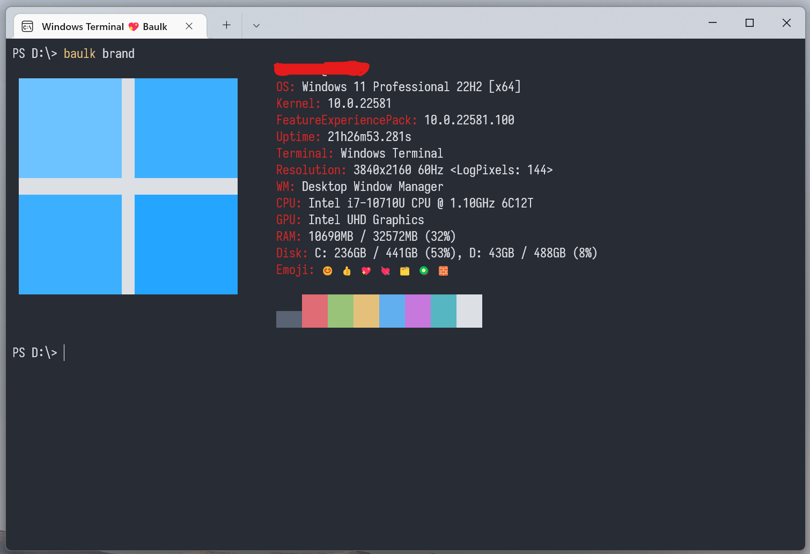

# CHANGELOG

### 4.0.2

+  Add wind -Streamlined file download tool
+  Improve unscrew 7z support
+  baulk/unscrew Appx is now Test Signed: [baulk-debug.cer](https://github.com/baulk/baulk/blob/master/msix/baulk-debug.cer)
+  chromium zlib sync zlib 1.2.12
+  baulk-exec supports the `--` parameter as a flag to start parsing subcommands

```powershell
# baulk run command -jack, Previously this command was not supported unless the path form was used.
baulk-exec -V -- -jack -v
```

## 4.0.0

Baulk 4.0 adds a vfs mechanism to avoid mixing program data and installed packages when installing packages. It also adds the following features: 

- Better **VFS** design
- More C++20/23 experience
- Better file extraction experience, add `baulk extract` command.
- Limited compatibility with scoop manifest (Compatibility mode operation, with certain limitations) 
- baulk breakpoint download support
- Integrate a better memory allocator, such as mimalloc
- baulk brand command (such as neofetch)
- Add a simple GUI extract command `unscrew`, ProgressBar base of `IProgressDialog`, support Windows 11 menu.
- Windows 11 context menu support

Note: since there is no developer account, the user needs to generate a signature and install the integrated windows 11 context menu.

baulk brand:



Unscrew Extractor:


Explorer context menu integration for Unscrew Extractor:

