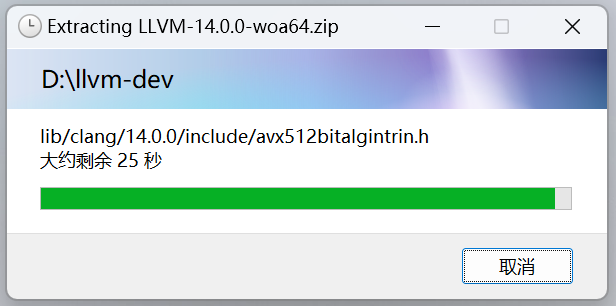
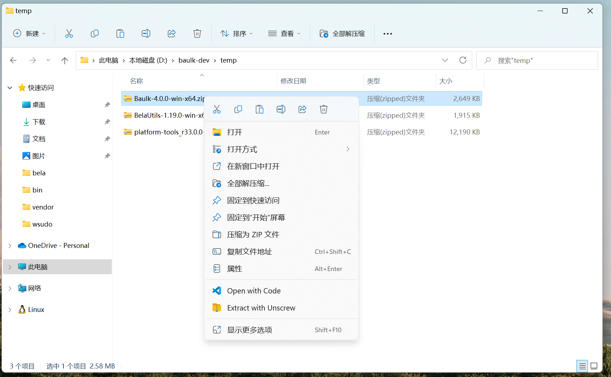

# Baulk Help

## Baulk Components

| Command        | Description                         | Remark                                                                                                                                     |
| -------------- | ----------------------------------- | ------------------------------------------------------------------------------------------------------------------------------------------ |
| baulk          | Minimal Package Manager for Windows | package manager                                                                                                                            |
| baulk-exec     | Baulk extended executor             | Construct baulk isolation environment context, and run other commands in this environment<br>baulk-terminal --> wt --> baulk-exec --> pwsh |
| baulk-dock     | Baulk environment dock              | Graphical tool to start different isolated terminal environments according to selection                                                    |
| baulk-terminal | Baulk Windows Terminal Launcher     | Start Windows Terminal and load the baulk isolation environment                                                                            |
| baulk-update   | Baulk's own upgrade tool            | A tool for updating baulk itself.                                                                                                          |
| unscrew        | Unscrew Extractor                   | GUI extractor tools                                                                                                                        |
| baulk-migrate  | Baulk easy migration tool           | **uncommon commands**: Migrate to new VFS mode, Usually no need to run                                                                     |
| baulk-lnk      | Baulk extended launcher (cli)       | **don't call internal command**: Launcher proxy, Start the command in the corresponding package according to the installation information  |
| baulk-wlnk     | Baulk extended launcher (win32 gui) | **don't call internal command**: Launcher proxy, Start the command in the corresponding package according to the installation information  |

## Baulk Usage

```txt
baulk - Minimal Package Manager for Windows
Usage: baulk [option] <command> [<args>]
  -h|--help        Show usage text and quit
  -v|--version     Show version number and quit
  -V|--verbose     Make the operation more talkative
  -Q|--quiet       Make the operation more quiet
  -F|--force       Turn on force mode. such as force update frozen package
  -P|--profile     Set profile path. default: $0\config\baulk.json
  -A|--user-agent  Send User-Agent <name> to server
  -k|--insecure    Allow insecure server connections when using SSL
  -T|--trace       Turn on trace mode. track baulk execution details.
  --https-proxy    Use this proxy. Equivalent to setting the environment variable 'HTTPS_PROXY'
  --force-delete   When uninstalling the package, forcefully delete the related directories


Command:
  version          Show version number and quit
  list             List installed packages based on package names
  search           Search in package descriptions
  info             Show package information
  install          Install specific packages. upgrade if already installed. (alias: i)
  uninstall        Uninstall specific packages. (alias: r)
  update           Update bucket metadata
  upgrade          Upgrade all upgradeable packages
  freeze           Freeze specific package
  unfreeze         UnFreeze specific package
  b3sum            Calculate the BLAKE3 checksum of a file
  sha256sum        Calculate the SHA256 checksum of a file
  cleancache       Cleanup download cache
  bucket           Add, delete or list buckets
  untar            Extract files in a tar archive. support: tar.xz tar.bz2 tar.gz tar.zstd
  unzip            Extract compressed files in a ZIP archive
  extract           Extract files according to the detected archive format
  brand            Display os device details

Alias:
  h  help
  i  install
  r  uninstall
  l  list
  s  search
  u  update and upgrade
  e  extract

See 'baulk help <command>' to read usage a specific subcommand.

```

## Baulk executor

baulk provides the `baulk-exec` command, which is a special launcher. Through this command, we can initialize the isolated baulk environment variable context and start a new process. The new process inherits the baulk isolated environment variable context. The tool enables baulk to install multiple versions of the same software in parallel, and releases provided by different manufacturers do not need to take into account environmental variables to interfere with each other. The advantage of using baulk-exec is that there is no need to modify the system environment variables, the environment variable context is temporary, and the process is destroyed when it exits. At present, the Baulk Terminal we run is also implemented by baulk-exec, and baulk-exec can also be widely used in various CI pipelines.

baulk-exec usage:

```txt
baulk-exec - Baulk extend executor
Usage: baulk-exec [option] <command> [<args>] ...
  -h|--help            Show usage text and quit
  -v|--version         Show version number and quit
  -V|--verbose         Make the operation more talkative
  -C|--cleanup         Create clean environment variables to avoid interference
  -W|--cwd             Set the command startup directory
  -A|--arch            Select a specific arch, use native architecture by default
  -E|--venv            Choose to load a specific package virtual environment
  --vs                 Load Visual Studio related environment variables
  --vs-preview         Load Visual Studio (Preview) related environment variables
  --time               Summarize command system resource usage

example:
  baulk-exec -V --vs TUNNEL_DEBUG=1 pwsh

```

## Baulk Windows Terminal integration

Baulk also provides the `baulk-terminal.exe` program, which is highly integrated with Windows Terminal and can start Windows Terminal after setting the Baulk environment variable, which solves the problem of avoiding conflicts caused by tool modification of system environment variables and anytime. In addition, Baulk added a custom installation option integrated into the Windows Terminal plug-in during the installation process. You can also use Fragments.bat to manually integrate Baulk into Windows Terminal.

baulk-terminal (`baulk < 4.0 aka baulkterminal`) usage:

```txt
baulk-terminal - Baulk Terminal Launcher
Usage: baulk-terminal [option] ...
  -h|--help
               Show usage text and quit
  -v|--version
               Show version number and quit
  -V|--verbose
               Make the operation more talkative
  -C|--cleanup
               Create clean environment variables to avoid interference
  -S|--shell
               The shell you want to start. allowed: pwsh, bash, cmd, wsl
  -W|--cwd
               Set the shell startup directory
  -A|--arch
               Select a specific arch, use native architecture by default
  -E|--venv
               Choose to load one/more specific package virtual environment
  --vs
               Load Visual Studio related environment variables
  --vs-preview
               Load Visual Studio (Preview) related environment variables
  --conhost
               Use conhost not Windows terminal

```

In addition to starting Windows Terminal through baulktermainl, you can also modify the command line of the default terminal of Windows Terminal and use baulk-exec to start the shell, so that the newly created shell has the environment variable context of baulk:


## baulk-dock

Baulk Dock **Light Mode**:


Baulk Dock **Dark Mode**:


## Unscrew Extractor

A simple GUI extract command `unscrew`, ProgressBar base of `IProgressDialog`, support Windows 11 menu.

```txt
Unscrew - Baulk modern extractor
Usage: unscrew [option] ...
  -h|--help
               Show usage text and quit
  -v|--version
               Show version number and quit
  -V|--verbose
               Make the operation more talkative
  -d|--destination
               Set archive extracted destination (extracting multiple archives will be ignored)
  -z|--flat
               Make destination folder to flat
```



Explorer context menu integration for Unscrew Extractor:



## Enabling Long Paths in Windows

When extracting files with baulk, if you encounter a file that cannot be created because the name is too long, you can modify the long path setting. Unfortunately, Windows is not user-friendly here.

You can use Powershell from an Adminstrative Terminal:

```powershell
Set-ItemProperty `
  -Path HKLM:\SYSTEM\CurrentControlSet\Control\FileSystem `
  -Name LongPathsEnabled -Value 1
```