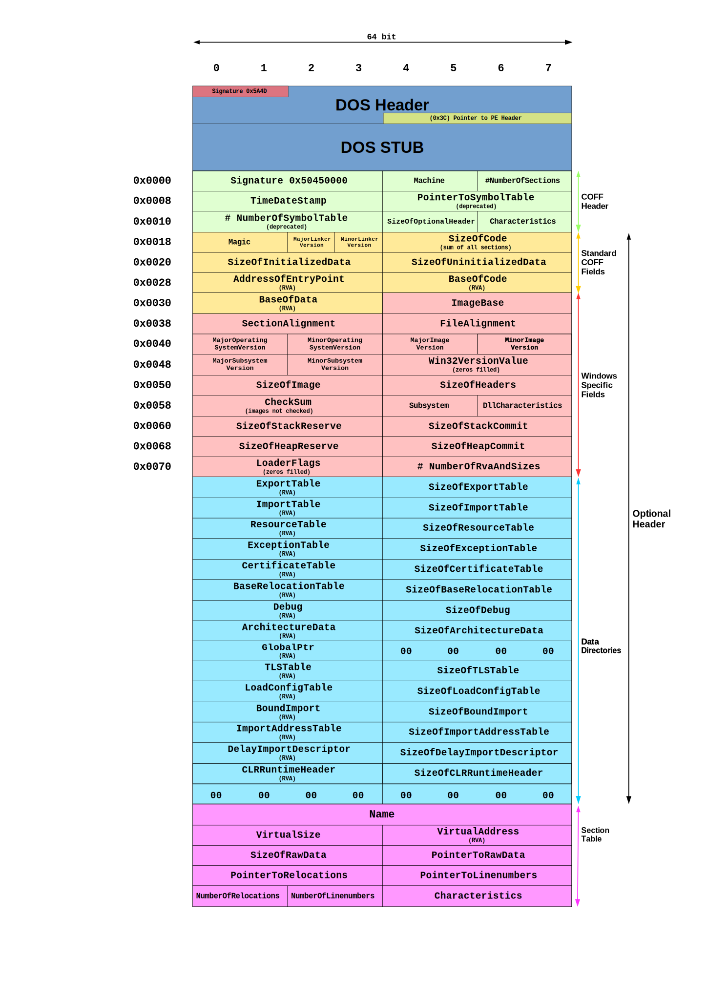

# PE format


Wikipedia: [https://en.wikipedia.org/wiki/Portable_Executable](https://en.wikipedia.org/wiki/Portable_Executable)

PE32 Format image (from: Wikipedia):




## IsWow64Process2

```c++
BOOL WINAPI IsOS(
  DWORD dwOS
);

void WINAPI GetSystemInfo(
  LPSYSTEM_INFO lpSystemInfo
);

void WINAPI GetNativeSystemInfo(
  LPSYSTEM_INFO lpSystemInfo
);

BOOL WINAPI IsWow64Process(
  HANDLE hProcess,
  PBOOL  Wow64Process
);

BOOL WINAPI IsWow64Process2(
  HANDLE hProcess,
  USHORT *pProcessMachine,
  USHORT *pNativeMachine
);
```

| | | |AMD64|x86|Arm64|
|---|---|---|---|---|---|
|IsWow64Process()|\*Wow64Process| |TRUE|0|0|
|GetSystemInfo()|wProcessorArchitecture| |PROCESSOR_ARCHITECTURE_**INTEL**|PROCESSOR_ARCHITECTURE_**INTEL**|PROCESSOR_ARCHITECTURE_**INTEL**|
| |lpMaximumApplicationAddress|/LARGEADDRESSAWARE:NO|0x**7**FFEFFFF|0x**7**FFEFFFF|0x**7**FFEFFFF|
| | |/LARGEADDRESSAWARE|0x**F**FFEFFFF|0x**B**FFEFFFF|0x**F**FFEFFFF|
|GetNativeSystemInfo()|wProcessorArchitecture| |PROCESSOR_ARCHITECTURE_**AMD64**|PROCESSOR_ARCHITECTURE_**INTEL**|PROCESSOR_ARCHITECTURE_**INTEL**|
| |lpMaximumApplicationAddress|/LARGEADDRESSAWARE:NO|0x**F**FFEFFFF|0x**7**FFEFFFF|0x**7**FFEFFFF|
| | |/LARGEADDRESSAWARE|0x**F**FFEFFFF|0x**B**FFEFFFF|0x**F**FFEFFFF|
|IsOS(OS_WOW6432)| | |TRUE|0|TRUE|
|IsWow64Process2()|*pNativeMachine| |IMAGE_FILE_MACHINE_**AMD64**|IMAGE_FILE_MACHINE_**I386**|IMAGE_FILE_MACHINE_**ARM64**|

# Thanks

Port from [https://github.com/golang/go/tree/master/src/debug/pe](https://github.com/golang/go/tree/master/src/debug/pe)